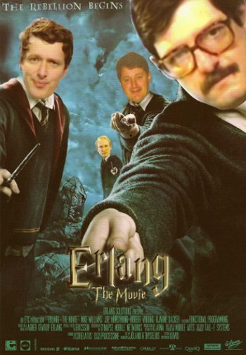

!SLIDE transition=uncover

# That's it!

!SLIDE bullets incremental transition=uncover

# Companies using Erlang #

* Heroku routing mesh
* GitHub egitd
* EngineYard's Vertebra
* Facebook Chat (based on ejabberd)
* Corelatus (SS7 monitoring)
* [More?](http://www.erlang.org/faq/introduction.html#id49883)

!SLIDE bullets incremental transition=uncover

# Resources

* erlang.org
* trapexit.org
* Programming Erlang: Software for a Concurrent World (PragProg)
* Erlang in Practice screencast series (PragProg)

!SLIDE center transition=uncover

### [Erlang the Movie](http://video.google.com/videoplay?docid=-5830318882717959520#)

!SLIDE transition=uncover

# Questions?
